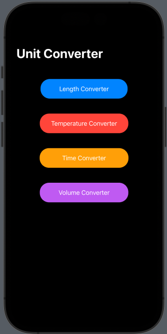
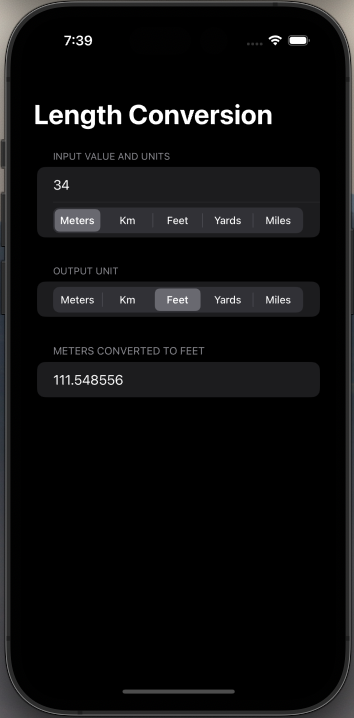
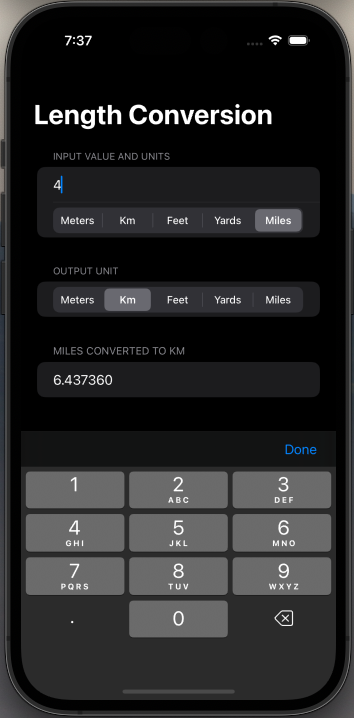

# Length Conversion App
## Mini Project 03

  

This is a unit conversion app that supports conversions for Volume, Temperature, Time, and Length. 

  

This app takes in an input and a chosen unit, and outputs the value of that unit converted to the specified output unit. While building this app, I gained experience using the Swiftui Navigation view, @Binding, and @State to handle user input. 

  

The app also used @FocusState to toggle the keyboard's visibility.
